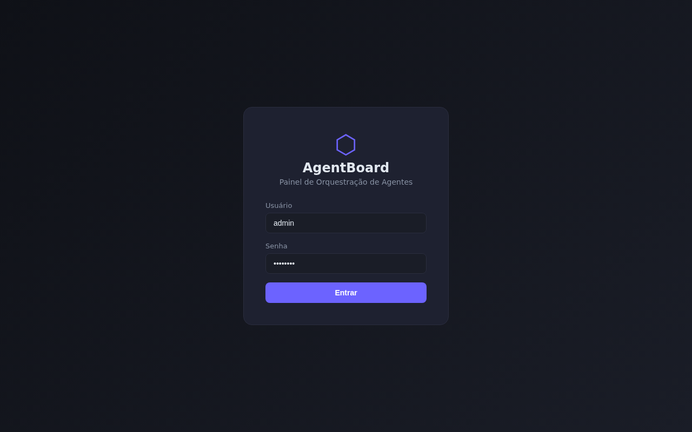
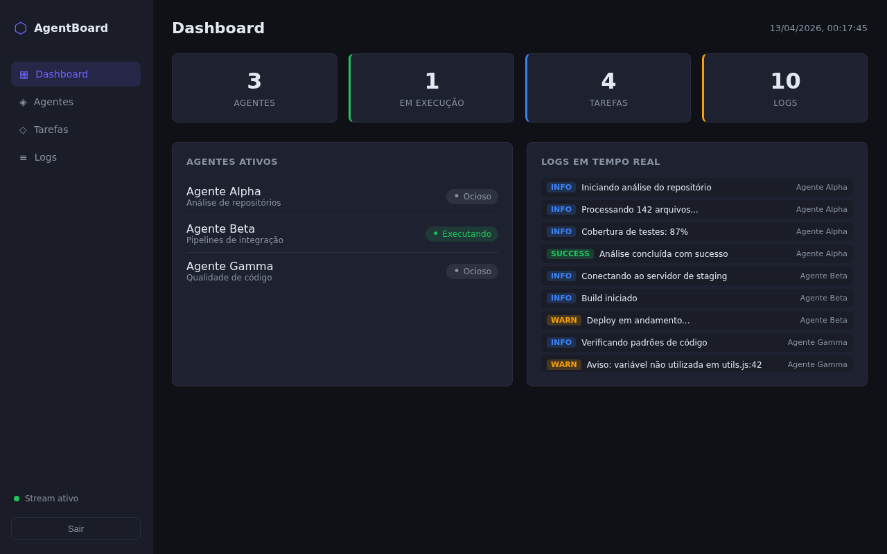
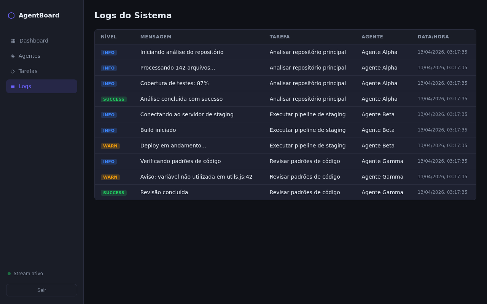

# AgentBoard — Painel de Orquestração de Agentes

Painel web local para criar, monitorar e gerenciar agentes de execução de tarefas. Visualize o status de cada agente, acompanhe logs em tempo real via SSE e mantenha histórico completo de todas as execuções.

## Funcionalidades

- Autenticação segura com JWT (token de 8 horas)
- Cadastro e gerenciamento de agentes com controle de status
- Criação e acompanhamento de tarefas por agente
- Streaming de logs em tempo real via Server-Sent Events (SSE)
- Dashboard com métricas consolidadas
- Interface responsiva com tema escuro
- API REST completa com 8 endpoints

## Screenshots

### Tela de Login



### Dashboard com Agentes em Execução



### Histórico de Logs



## Instalação

```bash
git clone https://github.com/NatanVP/agentboard-painel-orquestracao.git
cd agentboard-painel-orquestracao
npm install
```

## Como Usar

### Iniciar o servidor

```bash
npm start
```

Acesse em: `http://localhost:3000`

Credenciais padrão:
- Usuário: `admin`
- Senha: `admin123`

### Exemplos de uso via API

**Login:**
```bash
curl -X POST http://localhost:3000/api/auth/login \
  -H "Content-Type: application/json" \
  -d '{"usuario":"admin","senha":"admin123"}'
```

**Listar agentes:**
```bash
curl http://localhost:3000/api/agents \
  -H "Authorization: Bearer SEU_TOKEN"
```

**Criar agente:**
```bash
curl -X POST http://localhost:3000/api/agents \
  -H "Authorization: Bearer SEU_TOKEN" \
  -H "Content-Type: application/json" \
  -d '{"name":"Agente Delta","description":"Monitor de deploys"}'
```

**Criar tarefa:**
```bash
curl -X POST http://localhost:3000/api/tasks \
  -H "Authorization: Bearer SEU_TOKEN" \
  -H "Content-Type: application/json" \
  -d '{"agent_id":1,"title":"Verificar logs de produção"}'
```

**Acompanhar logs em tempo real (SSE):**
```bash
curl -N "http://localhost:3000/api/events?token=SEU_TOKEN"
```

## Referência da API

| Método | Endpoint | Descrição |
|--------|----------|-----------|
| POST | /api/auth/login | Autenticar e obter token JWT |
| GET | /api/agents | Listar todos os agentes |
| POST | /api/agents | Criar novo agente |
| PUT | /api/agents/:id/status | Atualizar status do agente |
| GET | /api/tasks | Listar tarefas (filtro por agent_id) |
| POST | /api/tasks | Criar nova tarefa |
| GET | /api/logs | Listar logs (filtro por task_id) |
| GET | /api/events | Stream SSE de eventos em tempo real |

## Tecnologias

- **Runtime:** Node.js
- **Framework:** Express
- **Banco de dados:** SQLite (sqlite3)
- **Autenticação:** JWT (jsonwebtoken)
- **Streaming:** Server-Sent Events (SSE)
- **Frontend:** HTML, CSS e JavaScript vanilla
- **Testes:** Jest + Supertest
