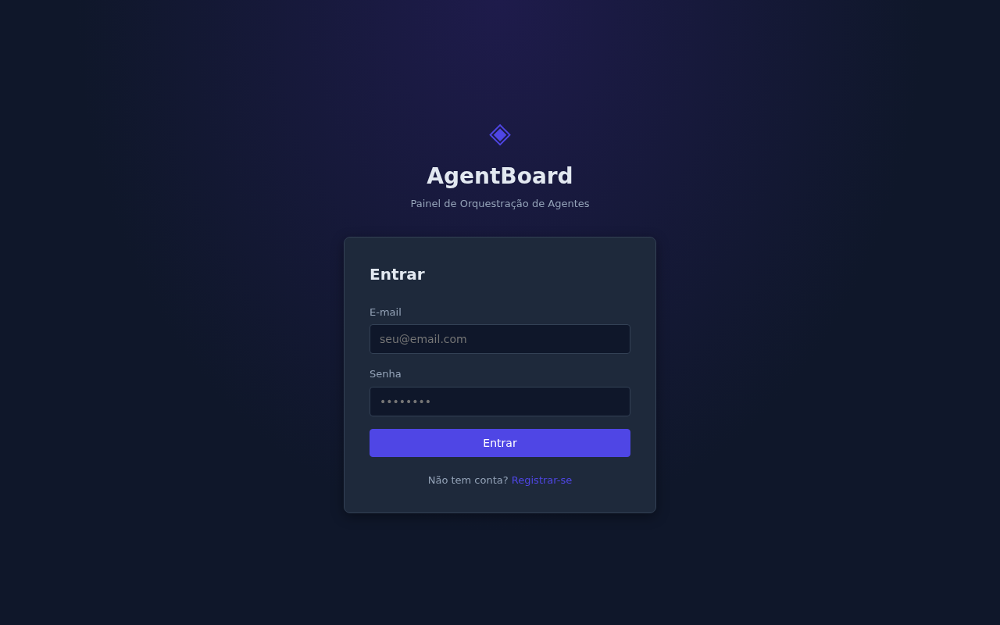
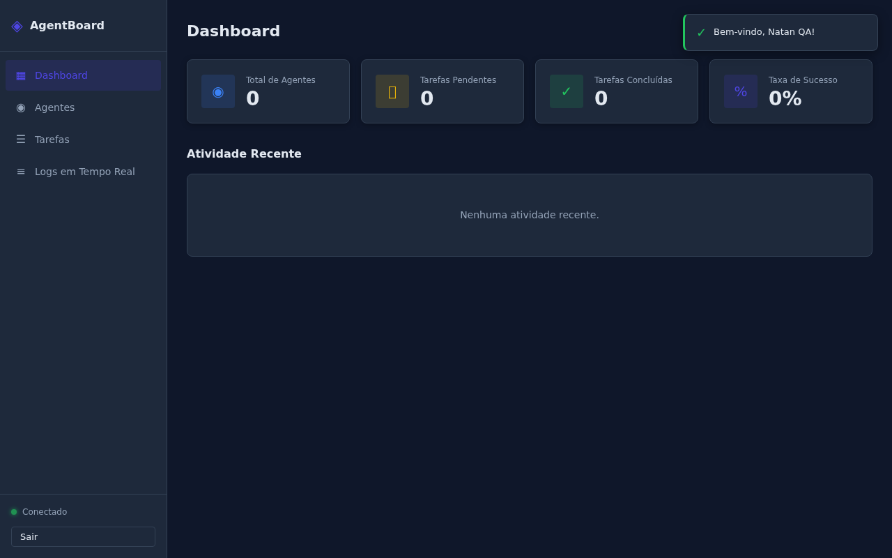
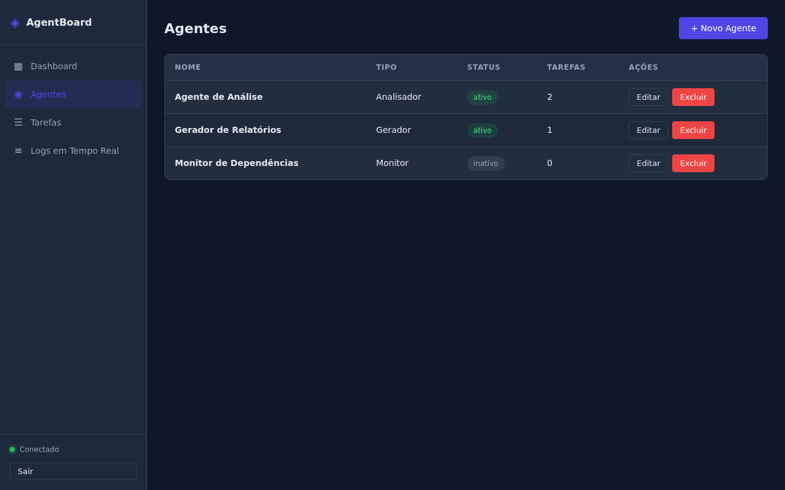
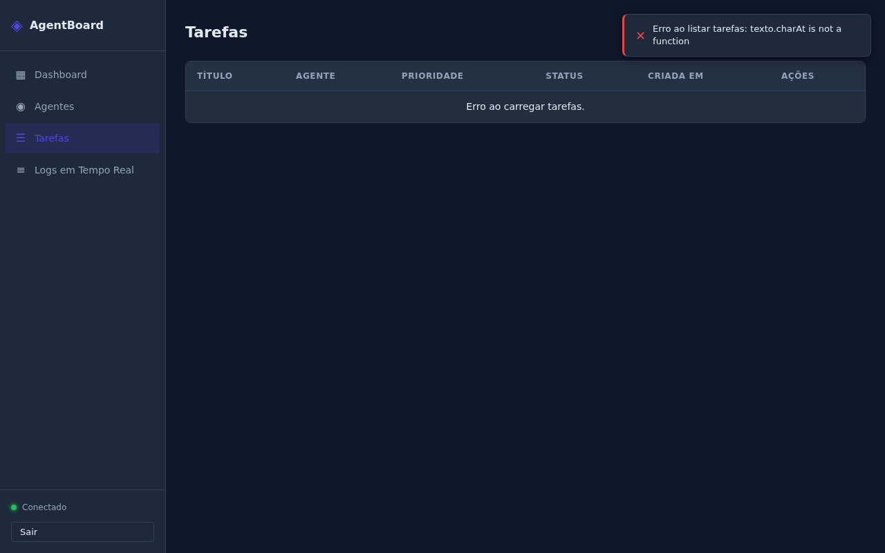

# AgentBoard: Painel de Orquestração de Agentes de Código

Sistema local para gerenciamento e monitoramento de agentes de código em tempo real. O AgentBoard oferece uma interface web para cadastrar agentes, enfileirar tarefas e acompanhar a execução via SSE (Server-Sent Events), com autenticação JWT e persistência em SQLite.

---

## Funcionalidades

- Autenticação de usuários com JWT (cadastro, login e perfil)
- Cadastro e gerenciamento completo de agentes de código
- Criação e acompanhamento de tarefas por agente
- Fila de execução com status em tempo real via SSE
- Logs detalhados de execução por tarefa
- Dashboard com estatísticas gerais do sistema
- Interface web responsiva, sem dependências externas

---

## Screenshots

### Tela de Login



### Dashboard Principal



### Listagem de Agentes



### Listagem de Tarefas



---

## Instalação

### Pré-requisitos

- Node.js 18 ou superior
- npm 8 ou superior

### Passos

1. Clone o repositório:

```bash
git clone https://github.com/NatanVP/agentboard-painel-orquestracao.git
cd agentboard-painel-orquestracao
```

2. Instale as dependências:

```bash
npm install
```

3. Configure as variáveis de ambiente:

```bash
cp .env.example .env
```

4. Inicie o servidor:

```bash
npm start
```

5. Acesse no navegador: [http://localhost:3000](http://localhost:3000)

---

## Como Usar

### Cadastrar um usuário

```bash
curl -X POST http://localhost:3000/api/auth/registrar \
  -H "Content-Type: application/json" \
  -d '{"nome": "Natan", "email": "natan@exemplo.com", "senha": "senha123"}'
```

### Fazer login e obter o token JWT

```bash
curl -X POST http://localhost:3000/api/auth/login \
  -H "Content-Type: application/json" \
  -d '{"email": "natan@exemplo.com", "senha": "senha123"}'
```

Guarde o campo `token` retornado. Ele será usado nos demais endpoints.

### Cadastrar um agente

```bash
curl -X POST http://localhost:3000/api/agentes \
  -H "Content-Type: application/json" \
  -H "Authorization: Bearer SEU_TOKEN" \
  -d '{"nome": "Agente Alpha", "descricao": "Responsavel por tarefas de build"}'
```

### Criar uma tarefa para o agente

```bash
curl -X POST http://localhost:3000/api/tarefas \
  -H "Content-Type: application/json" \
  -H "Authorization: Bearer SEU_TOKEN" \
  -d '{"agente_id": 1, "descricao": "Executar pipeline de testes", "prioridade": "alta"}'
```

### Assinar o stream de eventos em tempo real (SSE)

```bash
curl -N "http://localhost:3000/api/eventos?token=SEU_TOKEN"
```

### Consultar o dashboard

```bash
curl http://localhost:3000/api/dashboard \
  -H "Authorization: Bearer SEU_TOKEN"
```

---

## Referência da API

| Metodo | Endpoint | Descricao | Auth |
|--------|----------|-----------|------|
| POST | /api/auth/registrar | Cadastro de novo usuario | Nao |
| POST | /api/auth/login | Autenticacao e emissao de JWT | Nao |
| GET | /api/auth/perfil | Dados do usuario autenticado | Sim |
| GET | /api/agentes | Lista todos os agentes | Sim |
| POST | /api/agentes | Cria novo agente | Sim |
| GET | /api/agentes/:id | Detalhes de um agente | Sim |
| PUT | /api/agentes/:id | Atualiza dados do agente | Sim |
| DELETE | /api/agentes/:id | Remove um agente | Sim |
| GET | /api/agentes/:id/tarefas | Lista tarefas de um agente | Sim |
| GET | /api/tarefas | Lista todas as tarefas | Sim |
| POST | /api/tarefas | Cria nova tarefa | Sim |
| GET | /api/tarefas/:id | Detalhes de uma tarefa | Sim |
| DELETE | /api/tarefas/:id | Remove uma tarefa | Sim |
| GET | /api/tarefas/:id/logs | Logs de execucao da tarefa | Sim |
| GET | /api/eventos?token=TOKEN | Stream SSE de eventos | Via query |
| GET | /api/dashboard | Estatisticas gerais | Sim |

> Endpoints com **Auth: Sim** exigem o header `Authorization: Bearer SEU_TOKEN`.

---

## Tecnologias Utilizadas

| Tecnologia | Versao | Uso |
|------------|--------|-----|
| Node.js | 18+ | Runtime do servidor |
| Express | 4.x | Framework HTTP |
| SQLite3 | 5.x | Banco de dados local |
| jsonwebtoken | 9.x | Autenticacao JWT |
| SSE (nativo) | — | Eventos em tempo real |
| HTML/CSS/JS | — | Interface web sem frameworks |

---

## Estrutura do Projeto

```
agentboard-painel-orquestracao/
├── server.js          # Entrada principal, configuracao Express
├── database.js        # Inicializacao e schema do SQLite
├── package.json       # Dependencias e scripts
├── .env.example       # Variaveis de ambiente de exemplo
├── routes/
│   ├── auth.js        # Rotas de autenticacao
│   ├── agentes.js     # CRUD de agentes
│   ├── tarefas.js     # CRUD de tarefas
│   ├── eventos.js     # Stream SSE
│   └── dashboard.js   # Estatisticas
├── middleware/
│   ├── auth.js        # Validacao JWT
│   └── errors.js      # Tratamento de erros
├── public/
│   ├── index.html     # Interface web
│   ├── style.css      # Estilos
│   └── app.js         # Logica do frontend
└── screenshots/
    ├── tela_login.png
    ├── dashboard_principal.png
    ├── listagem_agentes.png
    └── listagem_tarefas.png
```

---

## Licenca

MIT
